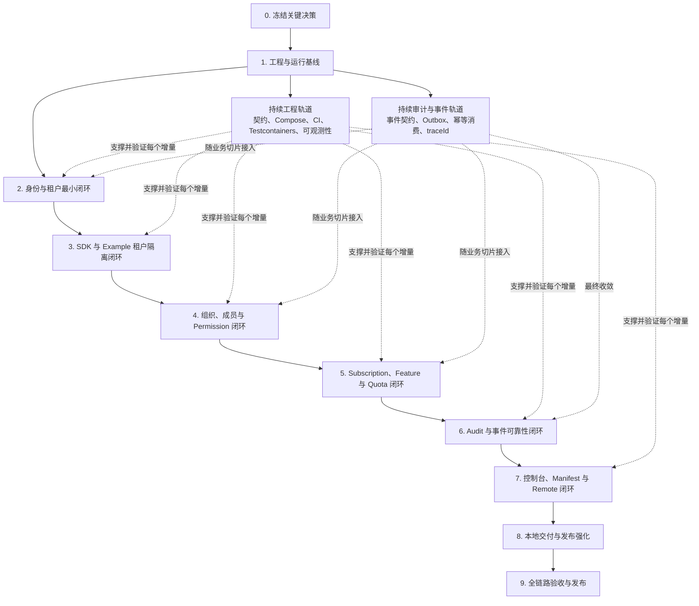

# MVP 开发计划清单

## 目标、边界与当前起点

本计划以 [产品范围](01-product-scope.md) 定义的 MVP 闭环为验收目标：

```text
部署平台 → 平台管理员配置权益 → 创建租户和订阅 → 初始化租户管理员
→ 租户管理员管理组织、成员和角色 → Project SaaS 接入 SDK
→ Tenant Context、Permission、Feature、Quota 校验 → 执行业务 → 审计可查询
```

已核实当前仓库仅具备 Maven 多模块骨架、Gateway 和四个服务的启动验证、SDK/Starter 制品坐标及目录边界；尚未实现 API、领域规则、数据存储、前端构建、Docker Compose 或官方 Example。因此下列事项均为待完成项。

MVP 不包含完整支付/账单/发票、公共注册和外部身份源、多语言 SDK、Schema Per Tenant 或 Database Per Tenant 隔离、CLI，以及 Helm/systemd 的完整生产交付。后两项在架构与配置上保持兼容，但按照 [路线图](15-roadmap.md) 中 Phase 1 的范围，不作为 MVP 发布阻塞项。

本文不包含工期或人员估算；现有文档未提供团队规模、可用工时或交付日期，不能据此给出可验证的排期。

## MVP 完成定义

- 本地执行 Docker Compose 后，可访问 Platform Console、Tenant Console Shell、官方 Project SaaS Example 与全部运行依赖。
- 平台管理员可创建 Feature、Quota Definition、Plan、Tenant、Subscription，并为租户初始化管理员。
- 租户管理员可创建组织、邀请并激活成员、创建租户角色、授权 Permission；平台角色与租户角色互不越权。
- Example 的业务 API 只能通过 Java SDK/Starter 获取可信 Tenant Context，并同时正确执行 Permission、Feature 与 Quota 校验；不同租户的数据经应用层和 PostgreSQL RLS 双重隔离。
- 登录、租户切换、授权/权益拒绝、配额操作和关键业务操作产生可查询审计记录。
- `./mvnw verify`、契约、集成、端到端、安全、性能与质量门禁全部通过，具体门禁见“9. 全链路验收与 MVP 发布门禁”。

## 实施顺序与依赖

实施采用纵向闭环，而不是先分别完成四个服务、最后再集成。每个阶段都必须在 Compose 环境中形成可运行、可测试的增量；契约、数据库迁移、CI、可观测性、审计和事件可靠性随业务切片持续演进。



阶段之间的主要依赖如下：

- IAM 与 Tenant Access 在第 2 阶段共同交付登录、Membership 校验、Tenant 切换和管理员初始化，不能按两个完全独立服务串行实施。
- SDK 可在公开契约稳定后生成客户端骨架，但其认证、Tenant Context、Permission、Feature、Quota 与 Audit 能力分别在第 3～6 阶段随服务端闭环完成。
- Gateway、Compose、CI、Testcontainers 和基础可观测性从第 1 阶段开始建设，并在后续阶段持续增强。
- 控制台页面可在对应公开 API 稳定后并行开发；第 7 阶段表示完整 Shell、Manifest 和 Remote 集成验收，不表示前端到该阶段才开始。

## 开发清单

### 0. 关键决策冻结

- [x] 评审并记录 Tenant、Subscription、Plan、Feature、Quota、Invitation 的枚举、允许状态迁移、幂等与错误码；实现必须遵循[核心领域契约](17-core-domain-contracts.md)。
- [x] 将 MVP Quota 限定为 `max_users` 与 `max_projects`，决定计量单位、`check`/`consume`/`release` 的结果语义、失败补偿规则和并发扣减策略；其他计量类型不阻塞核心闭环。
- [x] 决定首个 Platform Admin 的安全初始化方式、开发与生产的 JWT 私钥/KMS 接入方式，以及初始凭据轮换流程；见 [ADR 0007](adr/0007-system-creates-the-default-platform-admin.md)、[ADR 0008](adr/0008-production-jwt-signing-uses-kms.md) 与[安全设计](12-security-design.md)。
- [x] 确认 Platform Console、Tenant Console Shell、业务 Remote 的最终域名拓扑，从而确定 Cookie `SameSite`、CSRF 方案和 CORS 白名单；见 [ADR 0009](adr/0009-browser-surfaces-use-controlled-origins.md)、[API 设计](08-api-design.md)与[安全设计](12-security-design.md)。
- [x] 明确“Tenant 创建与管理员初始化”“邀请激活”“Tenant 切换”“成员禁用/Tenant 冻结”四条跨服务流程的数据所有权、同步调用、事件、失败恢复与幂等责任；见[跨服务工作流契约](18-tenant-access-cross-service-workflows.md)、[ADR 0010](adr/0010-tenant-access-cross-service-workflows.md)与[事件契约](../contracts/events/tenant-access-workflows.md)。
- [ ] 确认数据库、Redis 与应用日志规范以版本化文档和 CI 校验维护，不得以跨服务共享领域实体或数据库模型的方式实现。
- [x] 为影响服务边界、安全模型和公开契约的决策建立 ADR；跨服务流程见[ADR 0010](adr/0010-tenant-access-cross-service-workflows.md)，导出留存期、Manifest 审批细节等局部决策在对应阶段开始前冻结，不阻塞第 1～5 阶段。

**完成标准：** 第 1～5 阶段依赖的关键决策均可追溯，不存在会改变服务边界、安全模型或公开契约的未决规则。

### 1. 工程与运行基线

- [ ] 固化 Maven Wrapper、JDK 17 构建与 JDK 21 兼容性验证；补齐依赖版本管理、测试、覆盖率和制品发布的父 POM 约定。
- [ ] **先冻结 API 通用规范，再定义任何资源接口。** 在 `docs/08-api-design.md` 或其引用的规范文件中明确：路径、字段和枚举命名；UUIDv7、时间、日期、金额/小数与空值的 JSON 表示；路径参数、查询参数、请求头和请求体的使用边界；`POST`、`PUT`、`PATCH` 的请求体及部分更新语义；过滤、排序和游标分页；文件/异步任务；版本、幂等、关联 ID 和内容协商规则。
- [ ] 明确成功与失败的统一返回模型，并提供 OpenAPI 可复用 Schema 和正反例。现有设计已固定集合响应为 `{ items, nextCursor, hasMore }`，失败响应为 `application/problem+json`（含稳定 `code`、`detail`、HTTP 状态和 `traceId`）；还需决定单资源/创建响应是否采用通用外层包装。建议保持资源直接作为成功响应，避免额外的 `code/message/data` 包装；HTTP 状态表达协议结果，业务拒绝使用 Problem Details 的稳定 `code` 表达。若选择包装，必须同时定义其对 `201`、`202`、`204`、列表和缓存语义的影响。
- [ ] 在规范中重申租户安全边界：用户请求不得通过请求头、查询参数或请求体传入/覆盖 `tenantId`；服务身份只使用 `client_id` 与显式 `scope`，不得伪造用户上下文。
- [ ] 先在 `contracts/openapi` 定义第 2、3 阶段需要的 `auth`、Tenant 管理、JWKS 和最小 Runtime API；后续资源契约在对应阶段开始前评审并加入同一 v1 契约。
- [ ] 在 `contracts/protobuf` 定义 IAM↔Tenant Access 所需的 Membership 即时校验接口；在 `contracts/events` 定义统一 CloudEvents JSON 信封、审计事件和缓存失效事件的版本规则。
- [ ] 建立 spec-first 代码生成流程：服务端接口骨架、Java REST Client、前端 API Client 都从契约生成；禁止实现反向修改正式契约。
- [ ] 增加 REST、Protobuf 与事件的兼容性检查，阻止破坏性 v1 变更。
- [ ] **先发布数据库建模与迁移规范，再创建业务表。** 规范应覆盖：表/列/索引/约束的命名，类型、可空性、默认值和时区，UUIDv7 主键，外键的服务内边界，状态/软删除/历史记录的适用规则，以及 Flyway 版本、回滚/前向修复和数据回填约定。
- [ ] 明确公共持久化字段的适用矩阵：可变记录默认使用 `id`、`created_at`、`updated_at`、`status`，仅在需要软删除时使用 `deleted_at`；Tenant 范围表必须使用非空 `tenant_id`。全局表和平台表不得为了“统一”而伪造 `tenant_id`。`created_by`、`updated_by` 等操作者字段是否需要，由具体审计/查询需求逐表评审，不设为未证明必要性的强制列。
- [ ] 保持服务领域模型私有：不创建跨服务的 `BaseEntity`、共享 MyBatis Entity 或共享数据库表。若需要减少重复，只能在单个服务内部使用持久化辅助代码；跨服务共享物仍限于契约、构建 BOM、安全和可观测性库。
- [ ] 为 IAM、Tenant Access、Entitlement、Audit 分别配置独立数据库账号、Flyway 迁移链和 PostgreSQL UUIDv7 主键生成；禁止跨库表、外键与 SQL Join。
- [ ] 建立服务内 Transactional Outbox、可靠发布器和按事件 ID 幂等消费的统一工程约定；各服务在对应业务切片中落地自己的表和实现，事件携带并传递 `traceId`。
- [ ] 建立 Tenant 范围表的 RLS 测试夹具：非空 `tenant_id`、事务级 `app.tenant_id` 设置、默认拒绝策略，常规运行账号不拥有 `BYPASSRLS`。
- [ ] **先发布 Redis Key Registry，再接入 Redis。** 为每个 Key 定义固定前缀/环境/服务/用途/版本/标识符格式、值序列化、TTL、最大基数、失效事件、所有者和故障策略；至少覆盖 JWT `jti` 黑名单（TTL 为 Token 剩余有效期）、撤销 Signing Key `kid`、Refresh Token/会话缓存、登录保护、Gateway 限流和 SDK 的 Permission/Feature 短缓存。Key 中禁止存放 Token、密码、Secret、邮箱等原始敏感值；Redis 不得作为 Quota 额度真相。
- [ ] **先发布结构化日志规范，再写业务日志。** 规范应定义 JSON 日志事件的必填字段（时间、级别、服务、环境、事件名、`traceId`、`spanId`、`requestId`）、可选关联字段（Tenant、Identity、Membership、Client）和 HTTP/异常字段、字段白名单与脱敏、日志级别、采样、保留与查询规则。容器使用结构化标准输出由 Collector 收集；虚拟机以 `systemd`/日志转发收集，应用不依赖本地滚动日志文件。日志不能替代只追加的 Audit Record。
- [ ] 建立包含 Gateway、四个服务、PostgreSQL、Redis、Kafka 和 OpenTelemetry Collector 的最小 Docker Compose；S3 兼容存储在第 6 阶段加入。
- [ ] 使用 Testcontainers 建立 PostgreSQL、Redis 和 Kafka 集成测试基础设施，并建立首版 GitHub Actions 构建、单元测试、契约兼容性和迁移检查。
- [ ] Gateway 提供最小路由、Problem Details 错误规范化和 W3C Trace Context 透传；鉴权、限流和来源策略在后续闭环中逐步增强。

**完成标准：** API、数据库、Redis 与日志基础规范已版本化；最小契约可生成骨架；Compose 能启动基础组件；CI 能构建全仓库并执行契约、迁移和 RLS 测试夹具。

### 2. 身份与租户最小闭环

- [ ] 实现 Identity、Credential、Refresh Token、OAuth Client/Secret、Signing Key Metadata 的迁移、领域规则与仓储；密码使用 Argon2id，Refresh Token 和 Client Secret 仅保存哈希。
- [ ] 实现邮箱密码登录、约 15 分钟的 JWT Access Token、HttpOnly Refresh Token Cookie、登出、刷新轮换和 JWKS 发布；Token 仅携带 `identityId`、`membershipId`、`tenantId`、`jti`。
- [ ] 实现 Tenant 最小生命周期、Membership 和平台侧 Tenant 创建；按已冻结的跨服务流程安全初始化 Platform Admin 与 Tenant Admin。
- [ ] IAM 通过同步契约调用 Tenant Access 验证 Membership，实现 Tenant 切换并让旧 Token 失效。
- [ ] 实现登出、成员禁用和 Tenant 冻结的 `jti` 黑名单；Redis 不可用时用户 Token 验证必须 fail-closed。邀请激活和密码重置在第 4 阶段随成员闭环完成。
- [ ] 实现仅服务间使用的 OAuth 2.0 Client Credentials、最小 Scope、Secret 一次展示、重叠轮换和吊销；服务 Token 不建立用户 Tenant Context。
- [ ] Gateway 接入 JWKS 验签、Token 黑名单检查、用户与服务 Token 的最小 Scope 路由策略，并接入登录、Tenant 创建和 Tenant 切换的审计事件。

**完成标准：** 在 Compose 环境中可完成“Platform Admin 登录 → 创建 Tenant → 初始化 Tenant Admin → Tenant Admin 登录与切换 Tenant”；错误 Token、重放 Refresh Token、黑名单 Token、Redis 不可用和越权 Tenant 切换均有反向测试。

### 3. SDK 与 Example 租户隔离闭环

- [ ] 完成 BOM、`sdk-core`、`sdk-auth`、`sdk-tenant` 与 Starter 的首个可用版本；从公开契约生成 REST Client，不暴露内部 gRPC 或数据库模型。
- [ ] Starter 集成 Spring Security Resource Server 和 IAM JWKS，固定只接受 `RS256`，支持按 `kid` 缓存公钥、未知 `kid` 受控刷新、常规密钥轮换、撤销 `kid` 与 `jti` 的 Redis fail-closed 检查，以及不可写的 Identity/Membership/Tenant Context。
- [ ] 实现 Project/Task Example 的最小业务 API；仅经 Starter 获取 Tenant Context，并在租户范围表使用事务级 `app.tenant_id` 和 RLS。
- [ ] 为 Example 接入 Gateway 路由、结构化日志、Trace 和最小审计投递；此阶段不依赖控制台或 Module Federation Remote，可通过 API/种子数据验证。

**完成标准：** Tenant A 可创建和读取自己的 Project，但无法读、写、改、删 Tenant B 的数据；缺失 Tenant Context 默认拒绝；独立 Spring Boot 业务服务只引入 Starter 和受控配置即可获得可信上下文。

### 4. 组织、成员与 Permission 闭环

- [ ] 补全 Tenant 生命周期和平台侧管理：修改、启用、冻结、停用/到期；操作必须有平台权限和审计事件。
- [ ] 实现 Membership、Organization/OrganizationUnit、邀请、Role、Permission、Role-Permission、Membership-Role 的模型、RLS 访问与 v1 API。
- [ ] 完成邀请激活时的密码设置、密码重置、成员禁用及其会话撤销流程。
- [ ] 实现平台角色与租户角色的独立授权边界，以及 SDK/Gateway 所需的 Membership、Permission 查询接口。
- [ ] 完成 `sdk-permission`，提供 `@RequirePermission` 和编程式检查；使用本地短缓存、Kafka 失效事件和经 Gateway 读取权威结果的回源路径。
- [ ] 在 Example 注册 `project:create`、`project:list`、`project:export` 等 Permission，覆盖允许与拒绝路径；成员、角色、权限和邀请变更写入 Outbox 与审计事件。

**完成标准：** Tenant Admin 可邀请并激活成员、创建组织和角色、分配 Permission；同一 Identity 在不同 Tenant 可拥有不同 Membership 和角色；Example 的权限允许与拒绝均由集成和端到端测试覆盖。

### 5. Subscription、Feature 与 Quota 闭环

- [ ] 实现 Feature、Quota Definition、Plan、Plan-Feature、Plan-Quota、Subscription、不可变 Subscription Entitlement Snapshot 的迁移、领域规则和平台 API。
- [ ] 实现 Tenant 当前 Subscription 的单一生效约束、试用/到期/暂停等已冻结生命周期规则，以及套餐变更产生新订阅版本和权益快照。
- [ ] 实现 Runtime Permission/Feature 查询所需的权益接口；业务 Feature 不存在、禁用、未订阅、订阅到期均应稳定拒绝。
- [ ] 实现 `max_users` 与 `max_projects` 的 `check`、`consume`、`release`、`usage`：以数据库为额度真相，使用条件更新或行锁确保不超额，`operationId` 唯一保证重试幂等。
- [ ] 完成 `sdk-feature` 与 `sdk-quota`：提供 `@RequireFeature`、编程式 Feature 检查、同步 Quota API、Problem Details 异常映射及受控的超时、退避、重试和熔断。
- [ ] 为 Free 与 Professional 套餐配置 `project.basic`、`project.export`、`project.analytics`，以及 `max_users`、`max_projects`；在 Example 覆盖允许、未订阅、到期、超额和重复 `operationId` 路径。
- [ ] 发布权益变更与配额变更事件，供 SDK 缓存失效和 Audit 消费。

**完成标准：** 一个 Tenant 任意时刻不会拥有两个当前生效订阅；Example 同时执行 Permission、Feature 与 Quota 校验；并发扣减不超额，重复 `operationId` 不重复计量。

### 6. Audit 与事件可靠性闭环

- [ ] 定义最小审计事件白名单，记录 Tenant、Identity、Membership、Action、Resource、Request ID、IP、User Agent、时间、结果与经审查 Metadata；拒绝密码、Token、Client Secret 和原始敏感个人信息。
- [ ] 实现只追加 `audit_records`、按事件 ID 幂等消费、失败重试与死信/告警策略。
- [ ] 验证 IAM、Tenant Access、Entitlement、Gateway 和 Example 的业务事务均通过各自 Outbox 可靠投递事件，并能以 `traceId` 关联同步调用和 Kafka 链路。
- [ ] 完成 `sdk-audit` 的异步审计 API、失败处理和使用文档，不让审计投递无界阻塞业务请求。
- [ ] 在开始导出功能前，冻结授权范围、对象存储签名 URL 留存期和清理责任；在 Compose 中加入 S3 兼容对象存储。
- [ ] 实现经过授权的审计查询、游标分页和异步导出任务；导出结果存储为短期签名 URL，数据库只保存任务元数据。

**完成标准：** 关键闭环操作均能查询到不可修改的审计记录；事件重复消费不产生重复记录；失败事件可重试并进入受监控的死信路径；导出不阻塞请求且结果文件按配置自动清理。

### 7. 控制台、Manifest 与 Remote 闭环

- [ ] 初始化 TypeScript/React 前端工程与共享 API Client；Platform Console 和 Tenant Console Shell 独立构建、部署和测试。
- [ ] 交付 Platform Console 的 MVP 页面：登录、租户、Feature、Quota Definition、Plan、Subscription、平台管理员/角色、Manifest 审核和审计查询。
- [ ] 交付 Tenant Console Shell 的 MVP 页面：登录、Tenant 切换、组织、成员/邀请、角色/权限、套餐权益、Quota 使用、租户设置和审计查询；Shell 在内存保存 Access Token，提供认证 API 与共享 HTTP Client。
- [ ] 在开始 Manifest 功能前冻结审核/启停状态、审批责任和 Remote 来源规则；实现版本化业务能力 Manifest 及 Permission/Feature/Quota Definition 注册，仅允许 CI 的 Client Credentials 注册。
- [ ] 将 Project/Task 前端实现为 Module Federation Remote；只能由经审核的 Manifest 加载，只使用 Shell 暴露的认证 API 与共享 HTTP Client，不能读取或存储 Token。
- [ ] Gateway 完成由 `browser.rootDomain` 推导的 CORS 默认拒绝与精确白名单、`__Host-sf_refresh` Cookie、`X-SF-CSRF`/Origin/Fetch Metadata 防护和控制台/Remote 路由授权；禁止携带凭据的通配来源、`null` Origin 与 Manifest/运行时扩展白名单。

**完成标准：** 官方 Example 可证明 Core 不包含业务领域模型，同时完整展示租户隔离、角色、权益、配额、Remote 白名单与审计闭环。

### 8. 本地交付与发布强化

- [ ] 提供 Docker Compose：Gateway、四个服务、两个控制台、Example、含四个逻辑数据库和受限账号的 PostgreSQL、Redis、Kafka、S3 兼容存储及 OpenTelemetry Collector。
- [ ] 配置健康检查、初始化迁移、开发用受控密钥注入、`saasforge.test` 本地 TLS/域名拓扑、可重复的种子/清理策略和一条 Quick Start 命令；Quick Start 必须覆盖本地域名解析与证书信任前置条件，单节点依赖仅用于本地环境。
- [ ] 接入结构化日志、Trace、Metric 和健康探针；至少能关联 Gateway、服务调用、Kafka 事件和 Audit 的 `traceId`。
- [ ] 将 Gateway 强化为唯一公网入口并实现 Redis 令牌桶限流，按 IP、Identity、Client、Tenant 维度使用环境化阈值；领域服务不开放公网端口。
- [ ] 将数据库迁移、Redis Key Registry 和日志字段白名单接入 CI：迁移须符合服务数据库边界与 RLS 门禁，新增 Redis Key 须登记 TTL/所有者，日志测试须证明敏感字段不会输出。
- [ ] 完善 GitHub Actions：JDK 17/21 构建、单元/集成/契约/前端测试、覆盖率、依赖与镜像漏洞扫描、ZAP 基线扫描、镜像构建及 Compose 配置验证；Helm 完整生产交付不作为 MVP 阻塞项。
- [ ] 按文档补齐 Quick Start、API/SDK、部署、开发、数据隔离、安全边界和 Example 教程，并在开源文档中声明 MVP 范围与非目标。

**完成标准：** 新环境可按文档启动并完成核心闭环；CI 对代码、契约和运行镜像执行可重复验证。

### 9. 全链路验收与 MVP 发布门禁

- [ ] 单元、集成、契约、前端、端到端、安全与性能测试均按 [测试策略](13-testing-strategy.md) 落地；全仓库行覆盖率 ≥ 80%、分支覆盖率 ≥ 70%，IAM、Tenant Context、RLS、授权和配额行覆盖率 ≥ 90%。
- [ ] 用 Playwright 在 `saasforge.test` Compose 拓扑执行完整核心端到端闭环，验证 host-only Refresh Token Cookie、SameSite/CSRF/CORS 拒绝路径，以及 Tenant Console Shell 的菜单授权、业务 Remote 加载和拒绝路径。
- [ ] 用 Testcontainers 执行 RLS 强制门禁：Tenant A 上下文不可访问 Tenant B，缺上下文默认拒绝；同时验证用户/服务 Token 的越权、过期、撤销与 Redis 故障路径。
- [ ] 验证 Permission 与 Feature 组合拒绝、Subscription 到期、Quota 并发不超额和 `operationId` 幂等；验证审计只追加且不含敏感字段。
- [ ] 验证 Redis Key 的 TTL、命名空间和失效事件符合登记规范；验证结构化日志可按 `traceId` 关联链路，且不输出密码、Token、Client Secret、完整证件或其他原始敏感个人信息。
- [ ] 用 k6 在 100 RPS 基线和 200 RPS 突发下验证除异步操作外 p95 ≤ 300 ms、p99 ≤ 1 s；记录环境、数据量、瓶颈与报告，不虚构 Pod 规格。
- [ ] 通过依赖/镜像漏洞扫描及 ZAP 基线扫描；严重和高危漏洞、未通过契约/安全/RLS/端到端门禁均阻止发布。
- [ ] 以版本标签生成可追溯镜像、SDK 制品和 Compose 发布说明；记录版本、迁移、配置版本、操作者、结果与回滚演练结论。

**最终验收：** 在全新 Compose 环境中，由非实现者按 Quick Start 完成“平台配置 → 租户管理 → Example 接入 → 校验与审计”的闭环，且所有自动门禁通过。

## MVP 后续项

在 MVP 验收后，按 [路线图](15-roadmap.md) 继续处理 API Key、外部 OAuth/OIDC/SSO/LDAP、Webhook、事件扩展、完整支付与计费、更丰富 Quota、租户生命周期自动化、CLI、多语言 SDK、Schema Per Tenant、Database Per Tenant、Helm 完整生产交付和生态市场能力。
